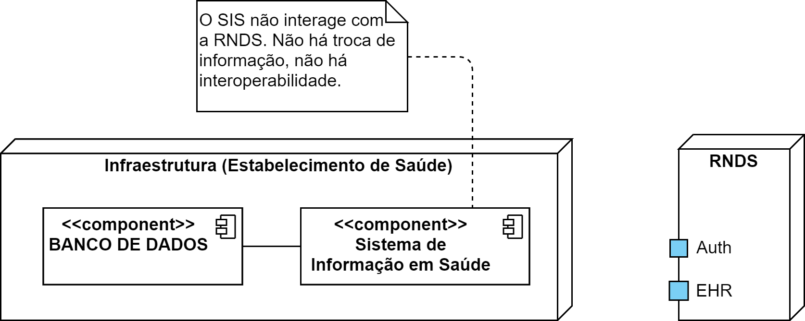
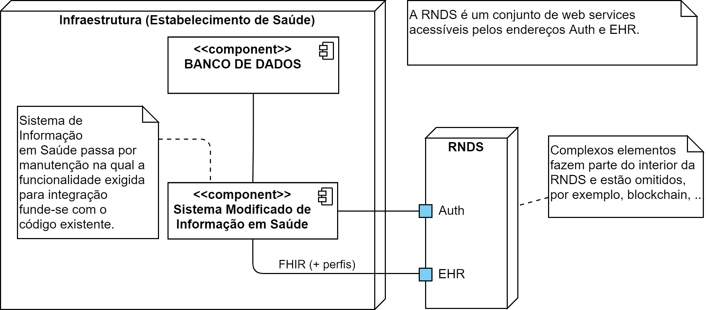
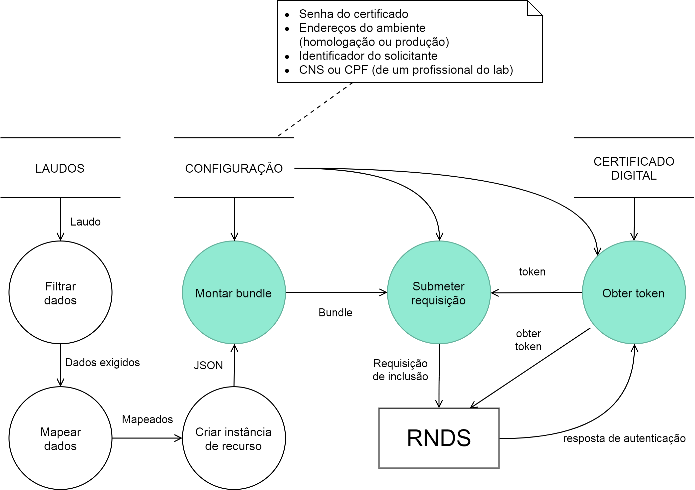

Conector é o nome dado à solução tecnológica que acessa a RNDS. É este software que precisa ser desenvolvido pelo integrador e, de fato, o que implementa a troca de informação em saúde com a RNDS. Por exemplo, no contexto de um laboratorio, faz parte das funções do Conector enviar o resultado de um exame laboratorial para a RNDS.

As seções seguintes apresentam questões típicas da integração com a RNDS por meio de um Conector de referência, abstrato o suficiente para que possa servir de orientação para vários estabelecimentos de saúde interessados em detalhes técnicos da integração com a RNDS.

## Sistema de Informação em Saúde (SIS)

Um estabelecimento de saúde usa, em geral, um Sistema de Informação em Saúde (SIS) para auxiliar na gestão das suas demandas, usuários, profissionais de saúde, procedimentos e outros.

Pode-se abstratamente representar todo e qualquer SIS como a união de dois componentes: (a) um Banco de Dados, no qual informações administrativas e outras de saúde são armazenadas; e (b) o software propriamente dito do SIS.

Esta abstração de um SIS qualquer é útil para identificar o que é denominado de Conector, o que é feito abaixo por meio de dois cenários, um no qual não há integração, e outro no qual há integração com a RNDS.

### SIS não integrado

Usando esta abstração, quando não há interoperabilidade do SIS com outro sistema, não há software de integração, não há Conector e, consequentemente, não há integração com a RNDS, conforme ilustrado abaixo.



### SIS integrado

A integração exige a existência do Conector.
A implementação das funções deste software pode assumir várias formas. Duas delas são apresentadas abaixo.

Na primeira, o SIS empregado pelo estabelecimento de saúde passa por uma manutenção na qual as funções do Conector são fundidas ao SIS existente. O SIS, agora modificado, torna-se um SIS que interage com a RNDS, um SIS integrado à RNDS.



Na segunda, um componente específico reúne e isola as funções necessárias para a integração com a RNDS, diferente do cenário anterior. Neste caso, é possível que o Conector seja encarregado de obter as informações em saúde a serem transferidas, possivelmente acessando diretamente o Banco de Dados do estabelecimento de saúde.


### _Design_ do Conector (sem restrições)

Convém esclarecer que estas duas formas de integração não são as únicas, e que a RNDS não impõe exigências na organização do SIS em questão. De fato, nem sequer há uma sugestão de _design_ para o Conector, o que depende de inúmeras variáveis específicas de cada estabelecimento de saúde, o que está além do escopo da RNDS.

## Conector de referência

Tendo em vista as especificidades de cada integração, única por estabelecimento de saúde, não é factível definir uma análise e um _design_ adequados para todos eles, contudo, isto não impede uma investigação preliminar com o objetio de oferecer uma orientação para integradores.

A compreensão de um Conector de referência, portanto,
visa familiarizar o integrador com questões naturais da integração com a RNDS.

## Escopo

O Conector, como qualquer outro software, visa atender alguma demanda. Neste caso, tal demanda (escopo) é a Portaria 1.792, que determina a obrigatoriedade de notificação de resultados de exame da COVID-19.

Convém observar que a notificação de laudo de COVID-19 é a primeira necessidade de troca de informação contemplada pela RNDS. Ao longo do tempo, outras necessidades serão incluídas, como o Sumário de Alta (SA) e o Registro de Atendimento Clínico (RAC), por exemplo. À medida que novas necessidades de integração forem implementadas pela RNDS, mais informações em saúde e outros tipos de estabelecimentos de saúde estarão envolvidos.


A discussão pertinente ao Conector de referência permanece relevante para outros estabelecimentos de saúde e para outras informações a serem trocadas.

## Requisitos

Toda a integração no escopo identificado acima pode ser suficientemente representada por dois casos de uso: _Obter token de acesso_ e _Enviar resultado de exame_. Respectivamente cobrindo a segurança e uma necessidade de interoperabilidade em saúde.


Apesar destes dois casos de uso serem apenas parte das funções do Conector, eles capturam o que é relevante e natural em toda e qualquer integração com a RNDS.

### Obter token de acesso

A obtenção de um _token_ de acesso é necessária para identificar o estabelecimento de saúde e verificar se o mesmo possui acesso aos serviços que irá requisitar à RNDS. Esta função, portanto, é exclusivamente para segurança.

Será necessário o certificado digital (e-CPF ou e-CNPJ) associado ao estabelecimento de saúde e a senha de acesso ao certificado. Estas duas informações serão empregadas para
efetuar uma requisição _https_ que, se executada satisfatoriamente, deverá retornar um objeto JSON como aquele abaixo.

```json
{
  "access_token": "longa sequência de caracteres",
  "scope": "read write",
  "token_type": "jwt",
  "expires_in": 1800000
}
```

O que interessa é o valor para `access_token`, uma sequência
de mais de 2K caracteres. Outro valor retornado é o tempo
de validade deste _token_, neste caso, 30min, ou 1.800.000ms. A expectativa é de que o Conector só realize uma requisição para obter _token_ de acesso cerca de 30 minutos após a última requisição. Neste intervalo, o Conector deve guardar o valor do _token_ a ser reutilizado, até que seja substituído por uma nova requisição, cerca de 30 minutos depois.

:::info IMPORTANTE
O Conector deve reutilizar o valor obtido para `access_token`
durante o período em que ele é válido. Isto significa que
muitas requisições aos _web services_ de saúde possivelmente serão feitas usando um mesmo valor de _token_, obtido de uma
única requisição para um _web service_ de segurança.
:::

A obtenção do _token_ de acesso é uma forma de autenticação
do Conector, ou melhor, do estabelecimento de saúde, usando
um certificado digital, uma estratégia mais segura que a autenticação comum usando o par usuário/senha.

:::info Java e JavaScript
Em https://github.com/kyriosdata/rnds encontram-se os
projetos `rnds-java` e `rnds-js`, ambos ilustram como obter
o _token_ de acesso, respectivamente nas linguagens Java e JavaScript.
:::

Aos interessados, muita informação pode ser encontrada
na internet para o assunto "ssl client authentication".

### Enviar resultado de exame

Na perspectiva de processos (funções) e do fluxo de informações entre eles, o envio de resultado de exame é ilustrado abaixo. Aqueles processos coloridos são genéricos no sentido em que não dependem do SIS em questão. Os demais dependem diretamente do SIS para o qual o Conector é criado.



As funções são comentadas abaixo após ressaltar que, dependendo do SIS em questão, algumas delas podem não ser
necessárias. Por exemplo, se um dado SIS já guarda informações sobre cada resultado de exame em documento XML próprio, então não será necessário coletar informações dispersas, filtrar e talvez nem tampouco efetuar algum mapeamento. Ou, se preferir,
estas funções foram realizadas, mas em momento distinto do
envio propriamente dito.

- **Filtrar dados**. Seleciona os dados de um resultado de exame contendo o que é necessário para o envio.

- **Mapear dados**. Realiza a conversão e/ou mapeamento, se for o caso, entre o que é recuperado (função acima) e o formato exigido pela RNDS. Por exemplo, a data "01/01/21" é
  mapeada para "01/01/2021".

- **Criar instância de recurso**. Os dados já filtrados e mapeados empregam uma estrutura de dados que precisa ser representada em JSON, em conformidade com o recurso FHIR (_resource_) pertinente.

- **Montar bundle**. Empacota os recursos pertinentes na representação JSON de um _Bundle_ (um dos recursos FHIR).
  Quando executada, esta função também pode realizar a
  verificação da representação resultante. Ou seja, assegurar
  que foi criada conforme esperado pela RNDS.

- **Obter token**. Obtém _token_ do _web service_ de segurança da RNDS para acesso aos demais serviços.

- **Submeter requisição**. Notifica o resultado de um exame à RNDS. Esta é a função que, de fato, realiza o envio desejado, faz uso de um _web service_ com foco na saúde. Observe que este envio depende do _token_ obtido pela função acima.

A figura abaixo ilustra os processos executados em uma sequência típica, além do _web service_ de segurança e daqueles de saúde oferecidos pela RNDS, identificados respectivamente por _Auth_ e _EHR_. Em tempo, tais serviços são oferecidos pelos [ambientes](rnds/ambientes) da RNDS.


Convém esclarecer que a especificação de requisitos de software está além do alcance deste documento, dado que só poderia ser produzida para uma situação específica de integração. A boa notícia é que estaria além do necessário
para a formação do integrador.

## Design

As funções identificadas para o Conector podem ser realizadas de várias maneiras. Abaixo segue apenas um possível _design_, dado que não são fornecidos detalhes de uma integração específica.

Nesta possível solução, o Conector é implementado por um
microsserviço acionado por evento. O evento sinaliza a geração de um laudo de exame, conforme ilustrado abaixo. Dessa forma, o
SIS é modificado para gerar um evento, e o microsserviço
notifica o Ministério da Saúde por meio da RNDS.


> IMPORTANTE: o emprego de um
> microsserviço visa ilustrar como o Conector pode ser
> implementado, em algum possível cenário, e não se confunde com uma recomendação.

Se um microsserviço vai se encarregar da integração, então deve armazenar os eventos recebidos, tentar submeter aqueles que ainda não foram enviados, talvez até por indisponibilidade temporária do serviço, e outras funções, como responder se um determinado evento foi submetido satisfatoriamente ou não e até mesmo a resposta da RNDS para um dado evento. Estas funções não serão tratadas aqui. Em vez destas operações derivadas, serão consideradas aquelas identificadas na seção anterior.

## Implementação

A construção do código do Software de Integração pode se beneficiar das [bibliotecas](rnds/tools/bibliotecas) disponibilizadas para compreensão acerca de como implementar a submissão de requisições para a RNDS.
