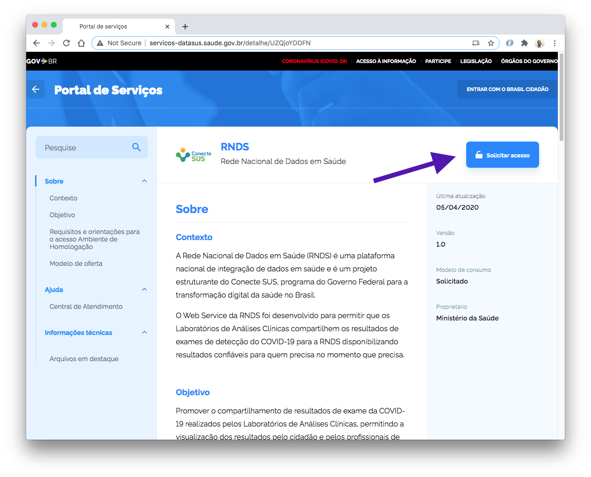

O [Portal de Serviços](https://servicos-datasus.saude.gov.br/) é um catálogo de _web services_ e APIs do Ministério da Saúde (MS) para integração à RNDS, dentre outros sistemas do MS. A página do Portal de Serviços é exibida abaixo, com destaque para o endereço na parte superior, https://servicos-datasus.saude.gov.br, o botão ENTRAR COM O BRASIL CIDADÃO (lado direito) e a opção pertinente à RNDS (lado esquerdo).

Para solicitar o acesso aos serviços da RNDS é necessário selecionar o ícone do serviço RNDS (opção esquerda destacada na figura acima). A página destino da RNDS inclui várias informações como contexto, objetivo, e muitos outros, conforme ilustrado abaixo, com o destaque (seta) para o botão "Solicitar acesso". 

Quando o botão "Solicitar acesso" (veja ilustração acima) é pressionado, a página resultante é a página do [gov.br](https://acesso.gov.br). Esta página é a mesma se o botão ENTRAR COM O BRASIL CIDADÃO, comentado acima, for acionado na primeira página. Para entrar é necessário que o gestor acesse sua conta gov.br. Se for o caso, veja detalhes acerca de como criar a conta [gov.br](./gov.br.md)

### Solicitação de acesso

A solicitação de acesso é realizada por meio de várias atividades. 

1. O profissional deverá possuir uma conta no “gov.br”, essa conta é um pré-requisito para realizar este credenciamento; (como obter essa conta? Explicar aqui);

1. Possuir um certificado digital, importante que seja do Tipo A1 ou certificado de chave públicas. Os certificados digitais vão garantir a segurança de acesso do profissional ao portal de serviços. (Explicar aqui como ele pode adquirir um certificado digital);

1. Após a conclusão das etapas 1 e 2 o profissional deverá realizar a solicitação de acesso, informando os dados do CNES de sua Instituição e gestor responsável e serviços (Como realizar esta solicitação);

1. Cumprindo todas etapas anterior o profissional deverá realizar a homologação fazendo os testes, bem como coletar evidências;

1. Após etapa 4 será o momento de iniciar a produção, e com a homologação exitosa deverá ser solicitado uma nova credencial (explicar aqui como realizar essa nova solicitação);

1. Em relação a melhor escolha dos navegadores todos são compatíveis, mas para um melhor resultado de seu acesso é recomendável que se utilize o Chrome, Mozilla ou Safari;

### Autenticação

A tela de autenticação, via conta gov.br já cadastrada, abrirá. Se o usuário ainda não possuir conta gov.br, é necessário clicar no botão “criar sua conta gov.br” ou se possuir, informe o seu CPF e depois clicar em Avançar.

É essencial ter a conta gov.br, por segurança, bem como para garantir a identificação de cada cidadão que acessa os serviços digitais do governo, usando computador, laptop/notebook ou smartphone, assim será solicitado ao usuário a Autorização de uso de alguns dados pessoais. É necessário concordar com os termos e após clicar em “Autorizar”.

Após realizar a autorização, o fluxo de solicitação de acesso será iniciado:

- Informar a origem da solicitação e após clicar em Próximo;

- Selecione a opção Ministério da Saúde para sistemas hospedados dentro da infraestrutura do Ministério da Saúde, ou selecione a opção outros para sistemas de estabelecimentos de saúde públicos ou privados que necessitem utilizar os serviços do Ministério da Saúde de acesso à RNDS e identifique o Estabelecimento Cessionário. No item "Certificado digital", clique na opção “Selecionar”;

- A tela Certificado digital apresenta duas opções válidas de autenticação por meio de certificado digital ICP-Brasil. Escolha uma delas e adicione o arquivo contendo a chave pública ou privada, de acordo com a opção escolhida, conforme:

  - Opção 1: o usuário pode utilizar a chave pública previamente extraída de um certificado digital válido;

  - Opção 2: o usuário pode utilizar um certificado digital do tipo A1 da cadeia ICP-Brasil e então inserir sua chave privada. A chave privada não será armazenada pelo DATASUS. Esta será utilizada apenas para extrair a respectiva chave pública.
