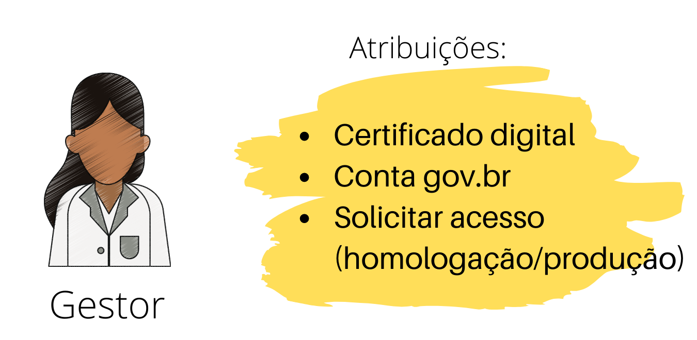

Gestor é o responsável pelo estabelecimento de saúde e quem formalmente assina o termo de compromisso com a RNDS.

O gestor também precisa compreender como o fluxo de informações deverá funcionar em relação ao envio e recebimento de informação, tanto com qualidade quanto precisão.

A integração com a RNDS exige atribuições distribuídas entre dois
papéis. Além do gestor, o outro é o [integrador](../ti/ti).

## Atribuições do gestor

As atribuições do gestor, detalhadas abaixo, são:
(a) adquirir certificado digital; (b) criar conta gov.br (caso não possua uma); (c) solicitar acesso aos serviços da RNDS (ambiente de homologação); (d) validar mapeamento e (e) solicitar acesso ao ambiente de produção.

### Adquirir certificado digital

Adquirir o certificado digital a ser utilizado para identificar o laboratório junto à RNDS. Este certificado é empregado no item seguinte (_solicitar acesso_) e também pelo _software_ de integração com a RNDS. O _software_ de integração é atribuição do responsável pela TI do laboratório (seção seguinte).

A execução satisfatória desta atribuição resulta em:

- Certificado digital, arquivo **.pfx**, disponibilizado.
- Senha secreta de acesso ao certificado disponibilizada para uso pelo profissional de TI do laboratório.

### Criar conta gov.br

O acesso digital a serviços oferecidos pelo governo demanda uma conta,
que pode ser criada no portal [gov.br](https://acesso.gov.br). O gestor,
caso não possua tal conta, terá que criar uma. Observe que esta conta será
necessária para solicitar acesso à RNDS (próximo passo). Detalhes acerca de
como esta conta pode ser criada, dentre outros, são fornecidos
[aqui](./gov.br.md).

A execução satisfatória desta atribuição resulta em:

- Conta gov.br do gestor do estabelecimento de saúde disponível.

### Solicitar acesso (ambiente de homologação)

Credenciamento junto à RNDS. Esta solicitação é necessária para credenciamento do laboratório junto à RNDS. Este credenciamento dá origem
ao **identificador do solicitante**, que será empregado pelo _software_ de integração. Esta solicitação é realizada com o apoio do responsável pela TI do laboratório, dado que depende de informações como faixa de IPs dos
servidores empregados pelo laboratório e identificação dos serviços a serem requisitados, dentre outros.

A execução satisfatória desta atribuição resulta em:

- Credenciamento concluído e submetido.
- Acesso ao ambiente de homologação concedido.
- Identificador do solicitante disponibilizada para uso pelo profissional de TI do laboratório. Este identificador é fornecido pela RNDS quando o acesso ao ambiente de homologação é concedido.

### Validar mapeamentos

Dados produzidos por um laudo devem ser mapeados para aqueles esperados pela RNDS, e o responsável pelo laboratório também é responsável pelo mapeamento correto.

O laboratório pode empregar uma terminologia ou códigos próprios para identificar os exames que realiza, enquanto a RNDS espera um código baseado no LOINC, por exemplo. Neste caso, cabe ao responsável pelo laboratório realizar o mapeamento entre os códigos que o laboratório faz uso e aqueles esperados pela RNDS.

A execução satisfatória desta atribuição resulta em:

- Revisão de todos os itens de dados exigidos pela RNDS para um resultado de exame de SARS-CoV-2.
- Identificação dos itens de dados dos quais aqueles exigidos pela RNDS serão obtidos.
- Identificação do mapeamento, se for o caso, entre o item de dado de origem do laboratório e o item de dado exigido pela RNDS.

### Solicitar acesso (ambiente de produção)

A atribuição final do gestor é requisitar o acesso ao ambiente de
produção e aguardar pela aprovação correspondente. A partir da aprovação, o estabelecimento de saúde poderá utilizar os endereços do [ambiente de produção](../rnds/ambientes) para as requisições correspondentes.
