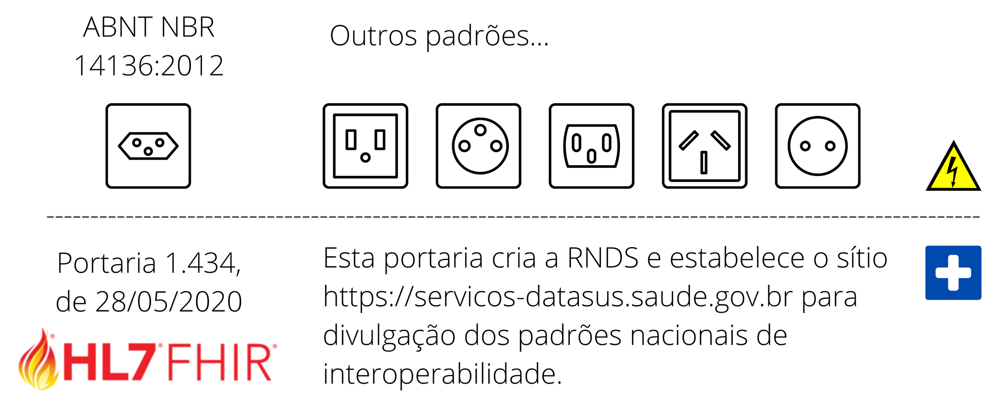

## Contexto

No domínio da energia elétrica, se um padrão é obedecido, então o usuário pode conectar o seu aparelho independe do fornecedor da energia. De forma análoga, um SIS pode ser desenvolvido independentemente da RNDS e trocar informações em saúde, desde que o contrato de interoperabilidade (o padrão adotado) seja observado. Neste sentido, a Portaria 1.434, de 28/05/2020 do Ministério da Saúde presta serviço análogo ao da norma ABNT NBR 14136:2012, que
define o padrão nacional de tomadas.

®Health Level Seven, HL7 e FHIR são marcas registrada da Health Level
Seven International. Estas marcas são usadas com a permissão da HL7 e este uso não
significa que a HL7 aprova ou endossa o presente Guia.

## Independência

Um estabelecimento de saúde integra-se à RNDS por meio do Sistema de Informação em Saúde (SIS) que utiliza. Ou seja, a integração ocorre por meio de software, em particular, definida
pelo padrão adotado pelo Brasil (a saber, FHIR). No momento certo os detalhes deste
padrão são apresentados.

Usar o padrão adotado pelo Brasil significa empregar uma API e esquemas de dados bem estabelecidos para transferir e obter informações em saúde no território nacional.
Adicionalmente, reconhecendo a impossibilidade de contemplar as especificidades e os
interesses locais de todo o planeta, o padrão inclui instrumentos para "personalização", como _perfis_ e _extensões_, o que resultam em uma adaptação.

O software de um SIS e a RNDS são “independentes”, podem evoluir independentemente, podem fazer uso de tecnologias distintas, linguagens de programação distintas e sistemas operacionais distintos, desde que conectados à internet e obedecendo o contrato, o SIS em execução local (_on premise_) ou nas "nuvens", a interação pode ocorrer. Nenhum deles depende ou impõe restrições ao outro. O contrato é a personalização nacional (adaptação).

## Análise

Antes de iniciar um esforço de desenvolvimento de software propriamente dito, é importante uma análise das funcionalidades esperadas na integração, bem como de oções de _design_ de software para tal. Natralmente, tendo em vista as especificidades de cada cenário de integração, não é possível definir uma análise e _design_ adequados para qualquer estabelecimento de saúde,
contudo, isto não impede uma investigação preliminar. A expectativa é que este esforço
de análise e _design_ que segue possa fornecer um ponto de referência e orientar integradores.

### Casos de uso

O _software_ de integração com a RNDS visa atender alguma demanda, neste contexto, a Portaria 1.792, que determina a obrigatoriedade de notificação de resultados de exame da COVID-19.

Convém observar que outros cenários poderão ser tratados de forma similar e, portanto, a análise e o _design_ permanecem relevantes para outros tipos de exames, outras informações e, naturalmente, não apenas laboratórios.

O diagrama acima contempla _Obter token de acesso_ e _Enviar resultado de exame_, não apenas por serem os principais, mas porque cobrem tudo o
que é necessário nos demais serviços.

Na perspectiva de processos (funções) e do fluxo de informações entre eles, o diagrama correspondente é fornecido abaixo. Aqueles destacados estão diretamente associados aos casos de uso identificados acima, ou seja, fazem parte do escopo a ser implementado. Os demais processos (funções) são necessários, mas ao mesmo tempo, dependentes do ecossistema do laboratório.

Cada função é definida e classificada quanto à fase em que é executada (preparação ou entrega).

- PREPARAÇÃO

  1.  **Filtrar**. Seleciona os dados de um resultado de exame a partir dos quais aqueles exigidos pela RNDS serão produzidos.
  1.  **Mapear**. Realiza a conversão e/ou mapeamento necessário entre os dados selecionados (filtrados) e aqueles no formato exigido pela RNDS.
  1.  **Empacotar**. Cria a representação JSON dos dados correspondentes a um
      resultado.

- ENTREGA
  1.  **Verificar**. Confere se o empacotamento do resultado a ser enviado está consistente com especificação da RNDS.
  1.  **Autenticar**. Obtém chave para acesso aos serviços da RNDS.
  1.  **Enviar**. Notifica o resultado de um exame à RNDS.

A figura abaixo ilustra os processos e a classificação deles, além de indicar que dois processos, via internet, interagem com as portas Auth e EHR, oferecidas pela RNDS. Detalhes são fornecidos em [Ambientes](../rnds/ambientes).

## Design

Dentre as funções atribuídas ao _Software de Integração_, ao todo seis, conforme seção anterior, duas delas não são contempladas aqui: (a) filtrar e (b) mapear. Estas funções são bem específicas e dependentes do ecossistema disponível no laboratório.

Na perspectiva de implantação (_deployment_), a figura abaixo
ilustra uma possível organização do ecossistema de software
utilizado por um laboratório, e sua integração com a RNDS.

Na figura, _Software de integração_ é
um componente isolado, distinto de um "Sistema Usado pelo Laboratório".
Em um dado laboratório, contudo, pode não existir um "Sistema Usado pelo Laboratório", ou até existir, mas a TI do laboratório propor um _design_ distinto no qual as funções aqui atribuídas ao _Software de Integração_
seriam incorporadas pelo "Sistema Usado pelo Laboratório".

Adicionalmente, se esta figura, por acaso, reflete parte do _design_ adotado por algum laboratório, ainda existem vários detalhes omitidos e relevantes para
o _design_ da integração. Por exemplo, a forma de obtenção dos dados
pertinentes aos resultados de exames e atualmente mantidos pelo "Software Usado pelo Laboratório", conforme nota pertinente na figura acima.

> IMPORTANTE: a figura acima, embora possa inspirar o _design_ da
> integração de um laboratório com a RNDS, apenas registra uma possibilidade cujo objetivo é orientar desenvolvedores de software acerca de questões pertinentes à tal integração.

## Implementação

A construção do código do Software de Integração pode se beneficiar das [bibliotecas](../tools/bibliotecas) disponibilizadas para compreensão acerca de como implementar a submissão de requisições para a RNDS.
