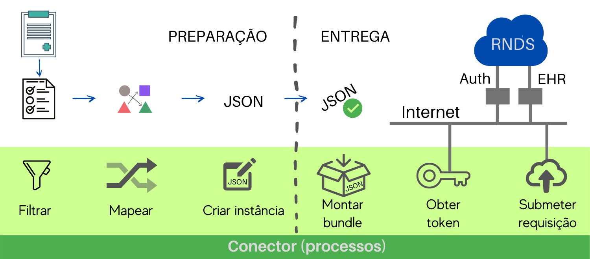

O _software_ de integração com a RNDS é específico para esta finalidade e, portanto, demanda esforço correspondente de profissional de TI.

As funcionalidades esperadas são fornecidas na seção seguinte. O _design_ de um _software_ correspondente e a implementação, por outro lado, dependem de um número significativo de variáveis, por exemplo, a linguagem de programação, o sistema de software utilizado pelo laboratório e
a política a ser utilizada para envio dos resultados, dentre outros.
Em consequência, só podem ser realizados caso a caso por cada laboratório.

As especificidades de cada laboratório, contudo, não impedem a produção de um _design_ para orientar e, inclusive, a implementação correspondente pronta para ser reutilizada por desenvolvedores (profissionais de TI), onde for o caso.

Este documento apresenta as funcionalidas, o _design_ para um cenário "clássico", a implementação correspondente e ferramentas para desenvolvedores.

## Funcionalidades

O _software_ de integração com a RNDS, a ser desenvolvido por cada laboratório, fará uso de vários serviços oferecidos. Dois deles são
representativos e estão explicitamente indicados na figura abaixo.

A documentação enfatiza _Obter token de acesso_ e _Enviar resultado de exame_. Não apenas por serem os principais, mas porque cobrem tudo o
que é necessário também pelos demais serviços.

O caso de uso _Obter token de acesso_ implementa segurança e seu processo é essencialmente técnico. Por meio deste caso de uso, empregando o certificado digital do laboratório, obtém-se o _token_ necessário para usufruir dos demais serviços. No diagrama fornecido abaixo, este caso de uso é realizado por meio da função "Autenticar". Todas as demais funções,
por outro lado, são necessárias para implementar o caso de uso _Enviar resultado de exame_.

Cada função é definida e classificada quanto à fase em que é executada (preparação ou entrega).

- PREPARAÇÃO
  1.  **Filtrar**. Dentre os dados produzidos para um laudo, aqueles necessários são selecionados.
  1.  **Mapear**. código empregados pelo laboratório e/ou transformações de dados necessários para se adequar às exigências da RNDS;
  1.  **Empacotar** os dados na representação a ser utilizada para envio (JSON).
  1.  **Verificar** o documento JSON correspondente ao laudo a ser enviado.
- ENTREGA
  1.  **Autenticar**. Obter a chave de acesso aos serviços.
  1.  **Enviar**. Atividade que notifica o resultado de um exame, conforme
      padrões estabelecidos pela RNDS, ao Ministério da Saúde.

A figura abaixo ilustra a classificação das funções, a ordem de execução destas funções e os dois ambientes (de homologação e produção).
A fase de preparação reúne funções "locais" ao laboratório, não demandam interação com um dos ambientes da RNDS. Por outro lado, as funções da
fase de entrega, _Autenticar_ e _Enviar_, depende do acesso a um dos
ambientes da RNDS.

## Design

Na perspectiva de implantação (_deployment_), a figura abaixo
ilustra uma possível organização do ecossistema de software
utilizado por um laboratório, e sua interação com a RNDS.

Na figura, _Software de integração_ é
um componente isolado, distinto de um "Sistema Usado pelo Laboratório".
Em um dado laboratório, contudo, pode não existir um "Sistema Usado pelo Laboratório", ou até existir, mas a TI do laboratório propor um _design_ distinto no qual as funções aqui atribuídas ao _Software de Integração_
seriam incorporadas pelo "Sistema Usado pelo Laboratório".

Adicionalmente, se esta figura, por acaso, reflete parte do _design_ adotado por algum laboratório, ainda existem vários detalhes omitidos e relevantes para
o _design_ da integração. Por exemplo, a forma de obtenção dos dados
pertinentes aos resultados de exames e atualmente mantidos pelo "Software Usado pelo Laboratório", conforme nota pertinente na figura acima.

> IMPORTANTE: a figura acima, embora possa inspirar o _design_ da
> integração de um laboratório com a RNDS, apenas registra uma possibilidade cujo objetivo é orientar desenvolvedores de software acerca de questões pertinentes à tal integração.
